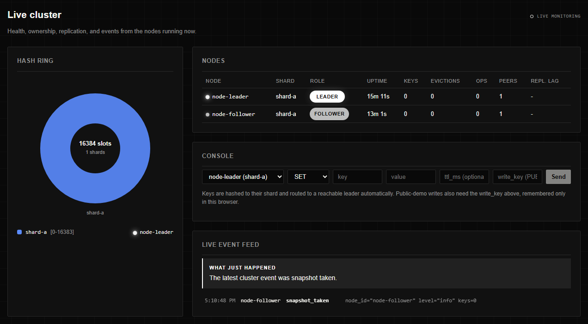
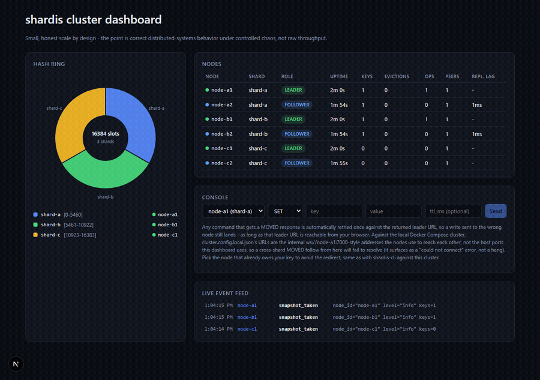

# Shardis

A distributed, in-memory key-value store built from scratch: replication,
sharding via consistent hashing, durability (AOF + snapshots), pub/sub, and
a live cluster dashboard. Built to understand what a system like Redis does
internally — replication protocols, hash-slot routing, heartbeat-based
failover, crash recovery — not to wrap an existing client library.

Scale is deliberately modest. The point is correct, observable
distributed-systems behavior under controlled chaos (kill a leader, watch
the cluster recover, measure how long it took), not raw throughput.



## What's actually here

All 17 steps of the original build plan (`docs/architecture.md`) are
implemented, tested, and validated against real running processes and
containers — not just "it compiles":

- **Core engine**: in-memory store, TTL (lazy + active sweep), LRU eviction
  under a memory cap.
- **Durability**: append-only log with an fsync before every ack, periodic
  snapshot + AOF compaction. Verified with a real `SIGKILL` mid-write-burst
  and restart, comparing a sha256 checksum of every key before and after.
- **Wire protocol**: JSON over WebSocket, with input bounds and malformed-
  message handling from day one.
- **Pub/Sub**: `SUBSCRIBE`/`PUBLISH`/`UNSUBSCRIBE`, cleanly dropping
  subscribers on disconnect.
- **Sharding**: Redis Cluster's own CRC16/16384-slot scheme (including
  `{hash-tag}` support), `MOVED` redirects for both cross-shard keys and
  "you hit a follower" writes.
- **Replication + failover**: a small full-mesh of peer connections per
  shard, leader-broadcast writes, heartbeats, deterministic promotion
  (lowest live node id) on leader timeout, and a full-resync protocol so a
  follower that was offline catches up instead of silently missing data.
  Verified with a real 3-process cluster: `SIGKILL` the leader, confirm the
  right follower is promoted, confirm the *other* follower's `MOVED`
  redirect points at the new leader (runtime-tracked, not the stale static
  config), confirm a recovering old leader steps down instead of causing
  split-brain.
- **Graceful shutdown**: real `SIGTERM` handling, verified against an
  actual Linux container (`docker compose stop`), not simulated — Windows
  doesn't deliver real signals to child processes, which is exactly the
  kind of platform gap this project tries not to paper over (see below).
- **Docker Compose**: the full 3-shard/6-node cluster, one image, real
  named volumes, `HEALTHCHECK`s that gate startup order.
- **Dashboard**: hash ring, live node table (polling `/healthz`+`/metrics`),
  a live event feed (every node's structured logs, streamed straight from
  the server), and an in-browser console. Talks directly to each node from
  the browser — no dashboard backend.
- **Benchmarks**: throughput, failover time, rebalance %, and replication
  lag — each run appends a dated, commit-tagged row to
  [`docs/benchmarks.md`](docs/benchmarks.md), not a one-off number.
- **CI**: unit + real-process integration tests on every push; a weekly
  workflow that boots the actual Compose cluster and re-runs the full
  benchmark suite.
- **Security**: write-key protection and per-connection rate limiting for
  the public demo, with `GET`/`SUBSCRIBE` always left open.

## Architecture

```
packages/
  node/         # the store node: engine, persistence, replication, hashring, protocol, security
  cli/          # shardis-cli - a WS client with MOVED-following
  dashboard/    # live cluster dashboard (Next.js, talks to nodes directly from the browser)
  benchmarks/   # throughput / failover / rebalance / replication-lag, each dated in docs/benchmarks.md
docs/
  architecture.md   # the original build spec this repo followed, step by step
  benchmarks.md     # dated results, one table per benchmark
  deployment.md     # how to actually put the Render+Vercel demo live
cluster.config.local.json    # 3-shard/6-node local topology (Docker Compose)
cluster.config.render.json   # reduced 1-shard/2-node public-demo topology
docker-compose.yml            # the primary environment - unlimited, free, real containers
render.yaml                   # Blueprint for the secondary public demo
```

Every node runs the identical binary; role (leader/follower) and shard
assignment come from `cluster.config.*.json` and env vars, not a code
branch. Any node can receive any client request: if the key belongs to a
different shard, or this node isn't currently that shard's leader, it
responds with `{"error":"MOVED","shard":...,"leader":...}` instead of
proxying — real Redis Cluster behavior, and `shardis-cli`/the dashboard
console both follow it automatically.

## What's real vs. simplified

Named here on purpose, not hidden:

- **Deterministic leader promotion, not Raft.** A follower that stops
  hearing from its believed leader computes the lowest node id among
  itself and its currently-live peers and promotes itself if it's that id.
  Any peer's self-declared "I am leader" is trusted by whoever observes
  it — including overriding a node's belief in its *own* leadership, which
  is what lets a recovering old leader learn it's been superseded without
  a coordinator. This is real, tested, working failover — it is not
  consensus, and a network partition could theoretically produce a brief
  split-brain window a real Raft/Paxos implementation would prevent.
- **Static topology, not gossip.** `cluster.config.*.json` is read once at
  boot. Adding or removing a node means editing that file and redeploying,
  not a dynamic membership protocol.
- **Hash-range partitioning, not virtual-node consistent hashing.** Each
  shard owns a fixed, contiguous block of the 16384 hash slots (exactly
  Redis Cluster's own scheme). This is simpler than a virtual-node ring,
  but it costs more on rebalance: [`docs/benchmarks.md`](docs/benchmarks.md)'s
  Rebalance table shows a real 3→4 shard *add* moving ~50% of keys,
  roughly double a virtual-node ring's textbook ~25% for that case — a
  genuine, measured consequence of redividing fixed ranges, not a guess.
  (A 3→2 *remove* happens to land close to its own ~50% textbook
  expectation — the two scenarios aren't symmetric, which is exactly why
  this is measured per-scenario instead of assumed.)
- **JSON over WebSocket, not a binary protocol.** Debuggable with
  `wscat`/browser devtools at the cost of some bytes on the wire.
- **No cross-shard MOVED healing across a real network gap.** A node only
  learns about *its own* shard's failovers live (via the peer mesh). A
  `MOVED` pointing at a *different* shard still comes from the static
  config, so it could theoretically be stale if that other shard failed
  over since this node last restarted. Documented, not fixed — full
  cross-shard gossip is out of scope for v1 (see below).

## Try it locally

```bash
pnpm install
pnpm --filter @shardis/node build   # everything else depends on this
pnpm --filter @shardis/node test    # 160 tests, including real SIGKILL/failover/SIGTERM scenarios
docker compose up -d                # the real 3-shard/6-node cluster
curl http://localhost:7001/healthz  # {"status":"ok","node_id":"node-a1","role":"leader","shard":"shard-a",...}
```

Then either `pnpm --filter @shardis/cli build && node packages/cli/dist/shardis-cli.js --url ws://localhost:7001/ws SET foo bar`,
or run the dashboard (`pnpm --filter @shardis/dashboard dev`, then
`http://localhost:3000`) and use its console instead.

Kill a leader for real and watch it recover:

```bash
docker compose kill -s SIGKILL node-a1
curl http://localhost:7002/healthz   # role flips to "leader" within HEARTBEAT_TIMEOUT_MS
docker compose up -d node-a1         # rejoins as a follower, full-resyncs, no split-brain
```



## Benchmarks

Full dated history in [`docs/benchmarks.md`](docs/benchmarks.md). Most
recent numbers as of this writeup:

| Benchmark | Result |
| --- | --- |
| Throughput | ~1,900–2,300 ops/sec (10–20 concurrent clients, mixed SET/GET, single node, this dev machine) |
| Failover | ~2.8s promotion time at the default 3000ms heartbeat timeout; first accepted write on the new leader within 10ms of that |
| Rebalance (3→4 shards) | ~50% of keys move — see "hash-range vs. virtual-node" above for why that's roughly double the textbook expectation |
| Replication lag | avg ~4.5ms, p95 ~7ms, over 50 writes on this dev machine |

Re-run any of them: `pnpm --filter @shardis/node build && pnpm --filter @shardis/benchmarks bench:<throughput|failover|rebalance|replication-lag>`.

## Live demo

Not deployed yet. `render.yaml` and `cluster.config.render.json` are
written and locally validated (the node boots correctly under the exact
env vars Render will set — see the Step 16 commit); actually putting it
live needs your own Render + Vercel accounts, which this session didn't
have access to. Follow [`docs/deployment.md`](docs/deployment.md) to do it
in a few clicks. Once live, expect:

- **Slow first request after idle.** Render's free services spin down
  after 15 minutes and take ~1 minute to wake on the next request.
- **No data survives a redeploy or spin-down/wake cycle.** No persistent
  disk on the free tier — a known, deliberate limitation of the public
  demo, not the local Compose cluster (which uses real volumes).
- **Writes need a key.** The public demo runs `PUBLIC_DEMO=true`; `GET`/
  `SUBSCRIBE` stay open, `SET`/`DEL`/`EXPIRE`/`PUBLISH` need `write_key`
  (`shardis-cli --write-key <key> ...`).

## Security posture

- **Write-protection**: `PUBLIC_DEMO=true` requires a `write_key` field
  matching `DEMO_WRITE_KEY` on every mutating request, compared with
  `crypto.timingSafeEqual` over a fixed-length hash (not a plain `===`,
  which leaks length/content through response-timing differences); reads
  stay open so anyone can watch the live cluster without being able to
  trash it. **Fails closed**: if `PUBLIC_DEMO=true` but `DEMO_WRITE_KEY`
  was left unset — a real misconfiguration, not a hypothetical — every
  write is rejected rather than silently letting them all through (a bare
  `undefined !== undefined` would otherwise read as "matches"). Off by
  default — local/CI stay open, no friction added to development.
- **Per-connection rate limiting**: a token bucket per WebSocket
  connection, capacity and refill both `RATE_LIMIT_RPS` (default 50/s).
  Over the limit gets a clean `{"error":"rate_limited"}`, never a dropped
  or crashed connection.
- **Per-connection subscription cap**: `SUBSCRIBE` is capped at 100
  distinct channels per connection. The per-message rate limit bounds how
  *fast* a client can act, not how much state each distinct action leaves
  behind — without this, one connection could still grow the pub/sub
  broker's channel map without bound over time, just more slowly.
- **Input bounds**: `MAX_KEY_BYTES`/`MAX_VALUE_BYTES`, enforced in the
  parser before anything touches the store, and `maxPayload` on the
  WebSocket server itself so an oversized frame is rejected before it's
  even fully buffered. A malformed or oversized message from one client
  gets a clean error and never affects another connection — verified
  directly, not assumed.
- **Non-root container**: the Docker image runs as `node:20-alpine`'s own
  non-root `node` user (uid 1000), not root — verified by actually
  starting a container and checking `whoami`/`id`, and that `/data`
  (including a real Compose named volume) is still writable under that
  user.
- **Zero known dependency vulnerabilities**: `pnpm audit` is clean and
  enforced in CI (`--audit-level moderate` fails the build); a `pnpm`
  override pins `postcss` past a set of dev-toolchain source-map
  disclosure advisories that Next.js's own pinned version hadn't picked up
  yet.
- **Transport**: `wss://`/`https://` are Render's and Vercel's own managed
  TLS — nothing to configure here, but worth saying explicitly rather than
  leaving it implicit.
- **Secrets**: `DEMO_WRITE_KEY` lives only in the Render dashboard
  (`render.yaml` marks it `sync: false` specifically so it's never
  committed) — never in the repo, never in client-side dashboard code.
- **Explicitly out of scope**: per-key ACLs, encryption at rest for the
  AOF file, mTLS between nodes, and per-IP/per-source connection-count
  limiting (left to the hosting platform's own infrastructure, the same
  way TLS termination is). Real production-Redis features this project
  doesn't attempt, named here rather than implied.

## Operability

- **`GET /healthz`**: `{status, node_id, role, shard, uptime_s}` — role is
  live (`replication.isLeader()`), not the boot-time `ROLE` env var, so it
  reflects an actual failover.
- **`GET /metrics`**: key count, evictions, `ops_total`, connected
  sockets/peers, and replication lag (`null` on a leader) — CORS-enabled
  specifically so the dashboard can read it directly from the browser.
- **Graceful shutdown**: `SIGTERM`/`SIGINT` stop accepting new writes
  (existing connections get a clean `{"error":"shutting_down"}`, not a
  hang or a silently dropped message), close every WebSocket with a clean
  1001 frame, then exit. This is exactly what Render sends before
  spinning a free service down.
- **Structured logs**: one JSON line per event to stdout
  (`write_applied`, `replication_applied`, `failover_triggered`,
  `leader_changed`, `moved_redirect`, `client_rejected`, ...) — the same
  events the dashboard's live feed streams live over WebSocket.

## What you'd add with more time

- **Raft-lite leader election**, replacing deterministic promotion — the
  single biggest "understands consensus" signal, genuinely hard, didn't
  want it to block shipping everything else.
- **Cross-shard gossip** so a `MOVED` to a different shard reflects that
  shard's *current* leader, not just its static config entry.
- **Gossip-based dynamic membership**, replacing the static topology file.
- **A compact binary wire protocol**, replacing JSON.
- **A write-key field in the dashboard console** — right now authenticated
  writes against a `PUBLIC_DEMO` node need `shardis-cli --write-key`.

## Development

```bash
pnpm install
pnpm audit --audit-level moderate   # zero known vulnerabilities, enforced in CI
pnpm --filter @shardis/node build && pnpm --filter @shardis/node test
pnpm --filter @shardis/cli build && pnpm --filter @shardis/cli test
pnpm --filter @shardis/benchmarks lint && pnpm --filter @shardis/benchmarks test
pnpm --filter @shardis/dashboard lint && pnpm --filter @shardis/dashboard test && pnpm --filter @shardis/dashboard build
```

207 automated tests across all four packages (160 node + 31 CLI + 4
benchmarks + 12 dashboard), all run in CI on every push.

Copy `.env.example` to `.env` and adjust per node — every config variable
a node reads is documented there.

## License

MIT — see [LICENSE](LICENSE).
