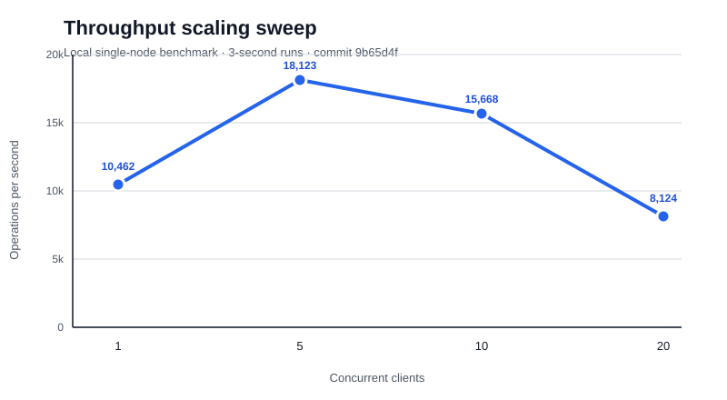

# Benchmarks

Every row here comes from an actual run of `packages/benchmarks`, dated
and tied to a git commit - not a one-off claim. Re-run any of these
yourself with `pnpm --filter @shardis/benchmarks bench:<name>` (build
`@shardis/node` first). See `docs/architecture.md` for what each
benchmark measures and why.

## Rebalance (naive re-bootstrap — NOT production-realistic; see Reshard below for real mechanism)

> **Note:** These numbers reflect a full range recompute from scratch (discard all slot assignments, redivide evenly). This is what a re-bootstrap looks like, not a live `redis-cli --cluster reshard`-style migration. The ~50% figure is expected for contiguous range repartitioning and is not a bug. The Reshard section below shows the production-realistic mechanism with explicit slot migration.

| Date | Commit | Scenario | Shards (before -> after) | Sample size | Keys moved | Moved % | Virtual-node textbook % |
| --- | --- | --- | --- | --- | --- | --- | --- |
| 2026-09-18T06:23:30.703Z | d0c35ad | add | 3 -> 4 | 10000 | 5015 | 50.15% | 25.00% |
| 2026-09-18T06:23:41.247Z | d0c35ad | remove | 3 -> 2 | 10000 | 4987 | 49.87% | 50.00% |
| 2026-09-18T07:38:43.235Z | f0cab07 | add | 3 -> 4 | 10000 | 5015 | 50.15% | 25.00% |
| 2026-09-18T07:39:46.382Z | f0cab07 | remove | 3 -> 2 | 10000 | 4987 | 49.87% | 50.00% |

## Reshard (live slot migration — production-realistic, zero client failures expected)

Live slot-by-slot migration with a concurrent write client. Only transient `ASK` redirects are acceptable; hard failures = 0 is the pass criterion. Run with `pnpm --filter @shardis/benchmarks bench:reshard`.

| Date | Commit | Slots moved | Requested % | Actual % | Keys transferred | Migration ms | Client ok | ASK redirects | Hard failures |
| --- | --- | --- | --- | --- | --- | --- | --- | --- | --- |

## Throughput

| Date | Commit | Clients | Duration (s) | Total ops | Ops/sec |
| --- | --- | --- | --- | --- | --- |
| 2026-09-18T06:23:56.204Z | d0c35ad | 10 | 5.01 | 11312 | 2260 |
| 2026-09-18T06:24:41.664Z | d0c35ad | 20 | 10.01 | 18708 | 1869 |
| 2026-09-20T08:43:28.899Z | 9b65d4f | 1 | 3.00 | 31386 | 10462 |
| 2026-09-20T08:43:36.267Z | 9b65d4f | 5 | 3.00 | 54369 | 18123 |
| 2026-09-20T08:43:44.782Z | 9b65d4f | 10 | 3.00 | 47021 | 15668 |
| 2026-09-20T08:43:51.682Z | 9b65d4f | 20 | 3.02 | 24575 | 8124 |

### Scaling sweep

The local single-node sweep (three-second runs, commit `9b65d4f`) peaked at
18,123 ops/sec with five concurrent clients, then declined at 10 and 20
clients. This is consistent with contention and event-loop saturation in the
single benchmark node; it is not a cluster-wide capacity claim. The 50- and
100-client runs need a benchmark-runner timeout/cleanup improvement before
they can be reported reliably, so they are intentionally omitted rather than
estimated.

## Failover

| Date | Commit | Heartbeat timeout (ms) | Promotion time (ms) | First write after promotion (ms) | Total recovery (ms) |
| --- | --- | --- | --- | --- | --- |
| 2026-09-18T06:24:09.434Z | d0c35ad | 3000 | 2838 | 8 | 2846 |

## Replication lag

| Date | Commit | Samples | Avg (ms) | p50 (ms) | p95 (ms) | Min (ms) | Max (ms) |
| --- | --- | --- | --- | --- | --- | --- | --- |
| 2026-09-18T06:24:18.750Z | d0c35ad | 20 | 4.2 | 4 | 7 | 2 | 7 |
| 2026-09-18T06:24:52.000Z | d0c35ad | 50 | 4.5 | 4 | 7 | 3 | 14 |
